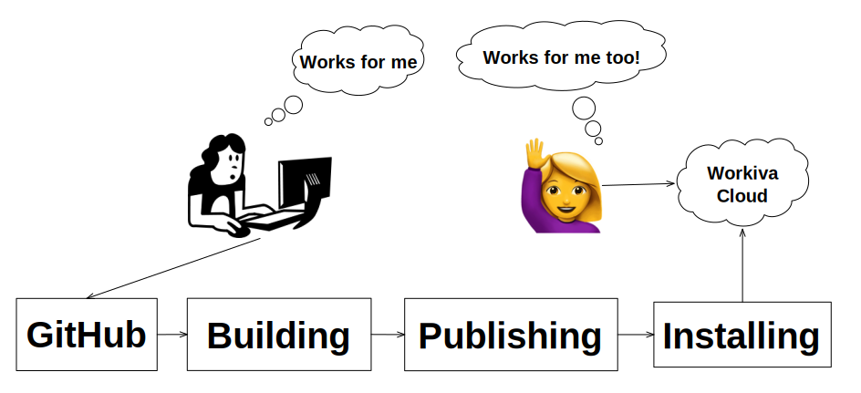

# Getting Started

### What's a Software Delivery Pipeline?

A software delivery pipeline is a system that includes a version control system
or VCS (such as git) and external tools that interact with the VCS and each
other to build, test, publish, and install software in a place where it can
be used by either Workiva customers and/or employees.

### How does the pipeline know about my software?

Our pipeline knows about different software projects primarily by listening
for events happening on GitHub as code changes are submitted and also by a few
internal web apps that you will interact with.

### Prerequisites
- You have installed git and you are comfortable with using it.
- You have a minimum development environment set up you can use to create a
simple app, the language and what it does is up to you.
- You have created a very simple app in your choice of language, it can be
a simple front end app, a back end service, or something full stack. Ultimately
you want something that you can interact with from the Workiva cloud development
environment

### Learning Goals

Understand what it takes to to get code that works on your development
machine published to the Workiva software ecosystem using Workiva's software
delivery pipeline.

#### It builds the stuff my software needs to run
#### It makes that stuff available (publishes) so it can be installed
#### It can be installed where others can use it

### Advanced Goals

#### It automatically tests how it interacts with other software that my software needs to use
#### It validates my software meets the minimum quality our customers require
#### It validates my software is secure
#### It provides me feedback about how well my software is working after it's installed